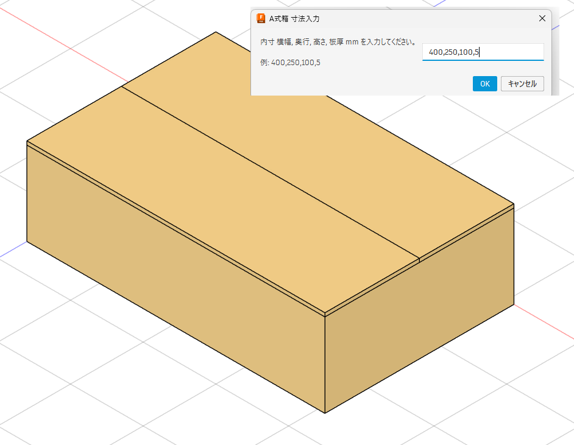
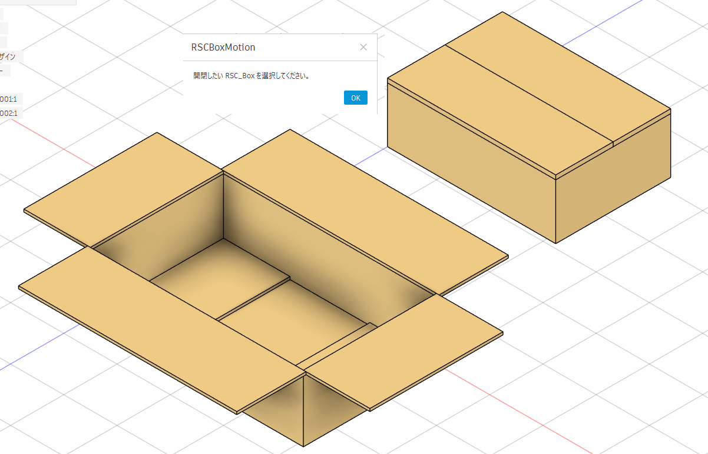

# fusion-rsc-box-tools

Fusion 360 add-ins for creating and opening/closing simple RSC style cardboard box models.

Fusion 360 用の、簡易的な A式箱 / RSC箱モデルを作成し、フラップの開閉表示を行うためのアドイン集です。

---
## Screenshots

### RSCBoxCreator

The add-in creates a simple RSC box from inner dimensions.

内寸を入力して、簡易的なA式箱モデルを作成します。

### RSCBoxMotion

Select a target `RSC_Box` from multiple boxes and open or close the upper flaps.

複数の `RSC_Box` から対象の箱を選択し、上部フラップの開閉表示を行えます。

## Overview

RSC stands for Regular Slotted Container, a common corrugated cardboard box style.

RSC は Regular Slotted Container の略で、一般的な段ボールA式箱に相当する形式です。

This repository contains small Fusion 360 Python add-ins created for practical packaging design work.

The add-ins generate a simple A-style / RSC cardboard box from inner dimensions and provide a basic open/close motion command for the flaps.

このリポジトリには、実務の包装設計作業を補助するために作成した Fusion 360 Python アドインが含まれています。

内寸から簡易的な A式箱 / RSC形式の段ボール箱モデルを作成し、別コマンドでフラップの開閉表示を行います。

---

## Add-ins

## アドイン一覧

### RSCBoxCreator

Creates a simple RSC/A-style cardboard box model from the following input values:

- inner width
- inner depth
- inner height
- board thickness

The add-in creates separate bodies for the bottom panel, side panels, front/back panels, and flaps, then stores box dimension information as Fusion 360 component attributes.

---

`RSCBoxCreator` は、以下の入力値から簡易的な RSC / A式箱モデルを作成します。

- 内寸 横幅
- 内寸 奥行
- 内寸 高さ
- 板厚

底板、側面パネル、前後パネル、フラップを個別のボディとして作成し、箱の寸法情報を Fusion 360 のコンポーネント属性として保存します。

---

### RSCBoxMotion

Opens and closes the flaps of a box created by `RSCBoxCreator`.

The add-in reads saved dimension attributes from the selected `RSC_Box` component and moves the flap bodies between closed and open states.

---

`RSCBoxMotion` は、`RSCBoxCreator` で作成した箱のフラップを開閉表示します。

選択された `RSC_Box` コンポーネントから保存済みの寸法属性を読み取り、フラップボディを閉じた状態と開いた状態の間で移動します。

---

## Environment

## 動作環境

- Autodesk Fusion 360
- Fusion 360 Python API
- Python add-in format

---

- Autodesk Fusion 360
- Fusion 360 Python API
- Python アドイン形式

---

## Notes

## 注意事項

This is a practical in-house CAD automation example for packaging design work.

It was created with AI assistance and manual verification in Fusion 360.

The current version is experimental and intended as a learning / workflow support tool, not a fully validated commercial package design system.

---

これは、包装設計作業のために作成した実務的な CAD 自動化のサンプルです。

AI の支援を受けながら作成し、Fusion 360 上で手動確認を行っています。

現在のバージョンは試験的なものであり、学習用・作業補助用のツールです。  
完全に検証済みの商用包装設計システムではありません。

---

## License

## ライセンス

MIT License

MIT ライセンス
